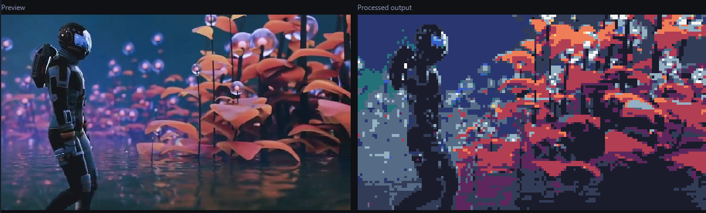
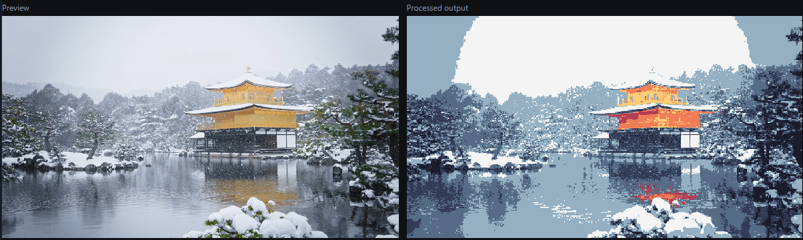
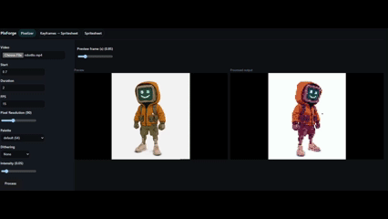

# Sprixel

Pixel-art video tooling in your browser. Convert clips into pixelated frames and export them as WebM, GIF, APNG, or individual PNGs. Build sprite sheets and detect keyframes — all client‑side, without servers.

### Original:

https://github.com/user-attachments/assets/449da638-86c3-4aba-a493-c9f437035cc0

### Processed:

[rendered.webm](https://github.com/user-attachments/assets/7a91add2-7726-4f7c-8165-011492f27539)

[rendered2.webm](https://github.com/user-attachments/assets/02c54ead-b7e7-4cac-8481-1aab7b156a15)

[rendered3.webm](https://github.com/user-attachments/assets/ad7e41b2-37fd-4f31-8c5c-f55d3e2485b3)

## Overview

Sprixel is a Preact + TypeScript + Vite web app focused on fast, local media workflows:
- Pixelize a video clip into low‑res, palette‑constrained frames with dithering.
- Export your result as WebM, GIF, APNG, or a sequence of PNG frames.
- Build sprite sheets from images with padding/extrusion and a JSON atlas.
- Detect keyframes (scene changes) from a video and export them as a sprite sheet.

Everything runs locally in the browser. No uploads, no backend.

## Features

- Pixelize tab
  - Load a video, set start time, duration, and FPS.
  - Choose a palette, enable dithering, and set intensity.
  - Control target pixel resolution (height) to get crisp pixel art.
  - Preview, process, and playback the result.
  - Export options:
    - WebM
    - GIF (uses a fixed palette when available)
    - APNG
    - PNG frames

- Spritesheet tab
  - Import multiple images.
  - Build a simple grid atlas with configurable columns, padding, and extrusion.
  - Preview the result, then export:
    - spritesheet.png
    - spritesheet.json (atlas metadata)
  - Optional: export an animated GIF from the imported frames using the selected FPS.

- Keyframes tab
  - Sample a video at a fixed rate and detect keyframes based on a threshold.
  - Preview detected times, select which ones to keep.
  - Export selected frames as a sprite sheet (PNG + JSON).
    
## Getting started

Prerequisites:
- Node.js 18+ (recommended) and npm

Install and run:
- npm install
- npm run dev
- Open the printed local URL in your browser

Production build:
- npm run build
- npm run preview

## Usage

- Pixelize
  1. Load a video file.
  2. Set Start (s), Duration (s), FPS, Pixel Resolution (height), Palette, Dithering, and Intensity.
  3. Click Process to generate frames and preview them.
  4. Export via WebM, GIF, APNG, or PNG frames.

  Notes:
  - Pixel Resolution sets the output’s pixel art height; width is scaled to preserve aspect ratio.
  - Dithering + Intensity help retain detail when mapping to limited palettes.

- PNG frames export
  - On browsers that support the File System Access API, you’ll be asked once to choose a folder; subsequent exports reuse it and save all frames there automatically.
  - On browsers without that API, exporting PNG frames will fall back to standard downloads (one download per frame).

- Spritesheet
  1. Import images (same size recommended).
  2. Configure columns, padding, and extrusion.
  3. Build and export the sprite sheet (PNG + JSON).
  4. Optionally export an animated GIF using the current FPS.

- Keyframes
  1. Load a video.
  2. Adjust the detection threshold if needed.
  3. Detect keyframes; select which detections to use.
  4. Export selected frames as a sprite sheet.

## Browser support

- Recommended: modern Chromium‑based browsers for best performance and access to the File System Access API (one‑time folder selection for PNG frames).
- Other browsers work, but saving PNG frames will use a per‑file download flow.

## Current status

- Fully client‑side; media never leaves your machine.
- Processing, quantization, and preview are implemented and functional.
- Exports available: WebM, GIF, APNG, PNG frames; sprite sheet (PNG + JSON).
- Performance depends on video size, duration, and FPS; long clips with many frames can be memory‑intensive.
- Known limitations:
  - Browsers without the File System Access API will prompt for each PNG frame download.
  - Animated formats (GIF/APNG) can take noticeable time on long/high‑FPS clips.
  - Exports do not include audio.

## Contributing

- Clone, install dependencies, and use the dev server.
- Please open issues for bugs or feature requests.
- Pull requests are welcome.

## Privacy

Your media is processed entirely in the browser. No uploads, no tracking.

## License

See the repository’s LICENSE file (or contact the author if not present).
